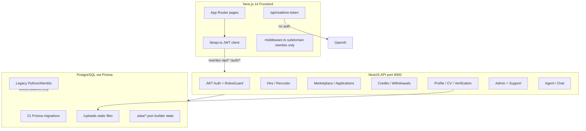

# Chakri AI — Full Codebase Audit Report

## Architecture Summary

| Layer | Stack | Key paths |
|-------|-------|-----------|
| Frontend | Next.js 14, TanStack Query, Zustand, localStorage JWT | [`frontend/app/`](frontend/app/), [`frontend/lib/api.ts`](frontend/lib/api.ts), [`frontend/middleware.ts`](frontend/middleware.ts) |
| Backend | NestJS 11, Prisma 7, Passport JWT, Redis rate limits (optional) | [`backend/src/`](backend/src/), [`backend/src/main.ts`](backend/src/main.ts) |
| Database | PostgreSQL, Prisma schema (35 models), no RLS | [`backend/prisma/schema.prisma`](backend/prisma/schema.prisma), [`backend/prisma/migrations/`](backend/prisma/migrations/) |
| Legacy | Python SQLAlchemy + Alembic (still debits credits) | [`backend/backend/db/repositories/credits.py`](backend/backend/db/repositories/credits.py) |
| Orphan modules | Not registered in [`backend/src/app.module.ts`](backend/src/app.module.ts) | `ChakriBuilderModule`, `LogoModule` |

**Auth model:** User JWT (`access_token` in localStorage) validated per-request against DB ([`backend/src/auth/jwt.strategy.ts`](backend/src/auth/jwt.strategy.ts)). Admin uses separate JWT with `scope: 'admin'`. No auth in Next.js middleware — all route guards are client-side `useEffect`.

**Background jobs:** `bullmq` in `package.json` but no processors in `backend/src/`. WebSocket adapter wired; no gateways found.

---

## Confirmed Issues

### Critical

#### C1 — Identity documents and CVs publicly accessible
- **Location:** [`backend/src/main.ts`](backend/src/main.ts) L32, [`backend/src/profile/profile.service.ts`](backend/src/profile/profile.service.ts) L49–59, L381
- **Problem:** `/uploads` is served via `express.static` with no auth. Files stored as `uploads/{userId}/{doc}-{timestamp}.ext`; API returns `file_path` to clients.
- **Impact:** NID, birth certificates, CVs downloadable by anyone who knows/guesses the URL.
- **Root cause:** Public static middleware + predictable paths.
- **Fix:** Remove public static route; serve via authenticated controller with ownership checks, or private object storage with signed URLs.

#### C2 — Payment execute replay grants credits repeatedly
- **Location:** [`backend/src/credits/credits.service.ts`](backend/src/credits/credits.service.ts) L183–212, [`backend/src/credits/credits.controller.ts`](backend/src/credits/credits.controller.ts) L22–27, L34–39
- **Problem:** `executeBkashPayment` never checks if `paymentId` was already credited. No unique constraint on `(userId, ref, action)`.
- **Impact:** Repeat POST `/api/credits/bkash/execute` or `/api/credits/purchase` credits user unlimited times (when stub payments allowed).
- **Root cause:** Missing idempotency key enforcement.
- **Fix:** Add `@@unique([userId, ref, action])` on `CreditTransaction`; check existing ref before incrementing ledger; integrate real bKash callback validation.

#### C3 — Prisma schema columns missing from migrations (fresh deploy fails)
- **Location:** [`backend/prisma/schema.prisma`](backend/prisma/schema.prisma) L49, L156–162; [`backend/prisma/migrations/20250620160000_company_profiles/migration.sql`](backend/prisma/migrations/20250620160000_company_profiles/migration.sql) L12–14; [`backend/src/hire/hire.service.ts`](backend/src/hire/hire.service.ts) L657–708
- **Problem:** `users.recruiter_type`, `companies.verified`, `trade_license`, `rl_no`, `contact_*` exist in schema but no migration adds them. `company_profiles` migration references `"verified"` column that was never created.
- **Impact:** `prisma migrate deploy` fails on clean DB; company verification and recruiter-type features break.
- **Root cause:** Schema updated without migration SQL.
- **Fix:** Add corrective migration creating all missing columns before dependent migrations run.

#### C4 — Split credit ledger between NestJS and Python backends
- **Location:** [`backend/backend/db/repositories/credits.py`](backend/backend/db/repositories/credits.py) L65–70; [`backend/src/credits/credits.service.ts`](backend/src/credits/credits.service.ts) L88–91, L191–196; [`backend/prisma/migrations/20250619180000_coin_types_withdrawals/migration.sql`](backend/prisma/migrations/20250619180000_coin_types_withdrawals/migration.sql)
- **Problem:** After coin-types migration, NestJS uses `silver_balance`/`gold_balance`; Python agent debits only legacy `balance`, never `silver_balance`.
- **Impact:** Incorrect balances shown in API; over-spend or under-charge depending on code path; admin `lifetime_spent` under-reported.
- **Root cause:** Dual backends sharing one table with partially migrated schema.
- **Fix:** Route all credit ops through NestJS; deprecate Python debit path; always update `silver_balance`/`gold_balance` atomically.

#### C5 — `job_preferences` column type drift (TEXT vs TEXT[])
- **Location:** [`backend/prisma/migrations/20250618120000_init/migration.sql`](backend/prisma/migrations/20250618120000_init/migration.sql) L215–216; [`backend/prisma/schema.prisma`](backend/prisma/schema.prisma) L365–366
- **Problem:** Init migration creates `job_types`/`platforms` as scalar `TEXT` storing JSON strings; Prisma schema declares `String[]`.
- **Impact:** Prisma read/write failures or corrupted preferences on signup ([`backend/src/auth/auth.service.ts`](backend/src/auth/auth.service.ts) L214–216).
- **Root cause:** Schema evolved without type-alter migration.
- **Fix:** `ALTER COLUMN job_types TYPE TEXT[] USING ...` (and `platforms`).

---

### High

#### H1 — Email verification rate limits disabled
- **Location:** [`backend/src/auth/auth.controller.ts`](backend/src/auth/auth.controller.ts) L75, L88–93, L102–108
- **Problem:** `assertEmailVerifyAllowed`, `recordEmailVerifyAttempt`, `assertEmailResendAllowed`, `recordEmailResend`, `deviceLimit.assertSignupAllowed` are commented out.
- **Impact:** Unlimited 6-digit OTP brute-force on `/auth/verify-email`; unlimited resend spam; unlimited signups per device.
- **Root cause:** Protective calls intentionally disabled.
- **Fix:** Re-enable all commented rate-limit calls.

#### H2 — Phone OTP verify has no brute-force protection
- **Location:** [`backend/src/profile/profile.service.ts`](backend/src/profile/profile.service.ts) L248–277; [`backend/src/common/api-rate-limit.service.ts`](backend/src/common/api-rate-limit.service.ts) (no verify limiter)
- **Problem:** `sendPhoneOtp` rate-limited; `verifyPhoneOtp` is not.
- **Impact:** 1M combinations brute-forceable per account.
- **Root cause:** No verify attempt counter.
- **Fix:** Add per-user verify limits (e.g. 5 failures / 15 min); invalidate OTP after max failures.

#### H3 — Unauthenticated OpenAI Realtime session minting
- **Location:** [`frontend/app/api/realtime-token/route.ts`](frontend/app/api/realtime-token/route.ts) L26–60
- **Problem:** Public POST creates OpenAI realtime sessions with no auth or rate limit when `OPENAI_API_KEY` is set.
- **Impact:** API key abuse, unbounded OpenAI spend.
- **Root cause:** No session/auth check before calling OpenAI.
- **Fix:** Require user JWT, per-user/IP rate limits, server-side interview context validation.

#### H4 — Automatic identity verification after 24 hours
- **Location:** [`backend/src/profile/profile.service.ts`](backend/src/profile/profile.service.ts) L27, L79–88, L196–212
- **Problem:** `maybeAutoVerify` sets `verificationStatus: 'verified'` after 24h in `pending` without human review.
- **Impact:** Users pass `assertCanApply` gate without admin review of NID/documents; undermines KYC.
- **Root cause:** Timer-based auto-approval called from `getCompletion`.
- **Fix:** Require admin approval via [`backend/src/admin/admin.service.ts`](backend/src/admin/admin.service.ts); remove time-based auto-verify in production.

#### H5 — Interview scoring trivially gameable
- **Location:** [`backend/src/marketplace/marketplace.service.ts`](backend/src/marketplace/marketplace.service.ts) L572–608, L750–758
- **Problem:** `scoreInterview` adds points for transcript length and keyword presence (`skill` names, "architecture", "delivered"). Client submits crafted transcript via POST.
- **Impact:** Seekers auto-pass to `recruiter_review` (score ≥ 75) without real interview; breaks hiring pipeline integrity.
- **Root cause:** Rule-based scoring trusts client-supplied transcript.
- **Fix:** Server-side AI evaluation, signed session tokens tying transcript to realtime interview, or human review.

#### H6 — Admin founder accounts seeded with default credentials
- **Location:** [`backend/src/admin/admin-bootstrap.service.ts`](backend/src/admin/admin-bootstrap.service.ts) L40–43; [`backend/src/admin/admin.constants.ts`](backend/src/admin/admin.constants.ts) L9–10
- **Problem:** If env vars unset, founders get password `ChangeMe!2026` and security answer `love` (hardcoded in source).
- **Impact:** Full admin portal compromise on fresh deploy without env configuration.
- **Root cause:** Bootstrap fallback to known defaults.
- **Fix:** Fail startup in production if founder env passwords unset; never use hardcoded defaults.

#### H7 — Stub payment endpoints grant credits without payment proof
- **Location:** [`backend/src/common/security/payments.util.ts`](backend/src/common/security/payments.util.ts); [`backend/src/credits/credits.service.ts`](backend/src/credits/credits.service.ts) L131–163, L183–214; [`backend/src/chakri-builder/chakri-builder.service.ts`](backend/src/chakri-builder/chakri-builder.service.ts) L55–66
- **Problem:** `purchase`, `purchaseGoldPack`, builder `purchase` grant entitlements when `PAYMENTS_STUB=1` or non-production.
- **Impact:** Free unlimited silver/gold/builder access if misconfigured.
- **Root cause:** Stub design; guard only blocks when `NODE_ENV=production && PAYMENTS_STUB!==1`.
- **Fix:** Never enable stub in production; separate dev-only routes; real payment webhooks.

#### H8 — Dual migration systems with conflicting `admin_audit_logs`
- **Location:** Prisma [`backend/prisma/migrations/20250620140000_admin_support/migration.sql`](backend/prisma/migrations/20250620140000_admin_support/migration.sql); Alembic [`backend/backend/alembic/versions/005_admin_audit_logs.py`](backend/backend/alembic/versions/005_admin_audit_logs.py)
- **Problem:** Same table name, incompatible column shapes; `CREATE TABLE IF NOT EXISTS` means first runner wins.
- **Impact:** Audit writes fail or land in wrong columns depending on migration order.
- **Root cause:** Legacy Alembic track not retired.
- **Fix:** Consolidate to Prisma-only migrations; drop Alembic for shared tables.

#### H9 — No Row Level Security
- **Location:** All 21 Prisma migrations, 6 Alembic migrations
- **Problem:** Zero `ENABLE ROW LEVEL SECURITY` / `CREATE POLICY`.
- **Impact:** Any `DATABASE_URL` holder can read/write all tenant data.
- **Root cause:** App-only authorization model.
- **Fix:** RLS policies if using Supabase Postgres; otherwise strict network isolation and least-privilege DB roles.

#### H10 — Frontend role guard runs after children mount
- **Location:** [`frontend/components/DashboardLayout.tsx`](frontend/components/DashboardLayout.tsx) L71–88; [`frontend/app/dashboard/recruiter/layout.tsx`](frontend/app/dashboard/recruiter/layout.tsx) L13–18
- **Problem:** Cross-role redirect in `useEffect`; children render before redirect. Recruiter layout only checks credential presence, not `role === 'recruiter'`.
- **Impact:** Wrong-role pages mount and fire API queries before redirect; safety depends entirely on backend RBAC.
- **Root cause:** Reactive guard instead of blocking render.
- **Fix:** Block render until `isPathAllowedForRole(pathname, role)`; recruiter layout must require recruiter role.

---

### Medium

#### M1 — Project agent chat mutates assignment state from free text
- **Location:** [`backend/src/marketplace/project-agent.service.ts`](backend/src/marketplace/project-agent.service.ts) L46–57, L172–184
- **Problem:** Messages containing "accept terms" or "accept budget N" update `status`/`agreedBudget` without dual-party consent.
- **Impact:** Either party can unilaterally activate assignment or change budget.
- **Fix:** Explicit confirmation endpoints with role checks and bilateral approval.

#### M2 — Mobile welcome bonus double-credit race
- **Location:** [`backend/src/credits/credits.service.ts`](backend/src/credits/credits.service.ts) L291–326
- **Problem:** `mobileBonusClaimed` checked outside transaction.
- **Impact:** Concurrent `POST /api/credits/claim-mobile-bonus` can credit twice.
- **Fix:** `updateMany({ where: { userId, mobileBonusClaimed: false }})` inside transaction; verify `count === 1`.

#### M3 — Public company jobs omit `verified` check
- **Location:** [`backend/src/companies/companies.service.ts`](backend/src/companies/companies.service.ts) L140–145 vs L149–162
- **Problem:** `getPublicProfile` requires `company.verified`; `listPublicJobs` does not.
- **Impact:** Active jobs from unverified companies leak via `/api/companies/:slug/jobs`.
- **Fix:** Add `verified: true` to company lookup in `listPublicJobs`.

#### M4 — Unverified companies can post active marketplace jobs
- **Location:** [`backend/src/hire/hire.service.ts`](backend/src/hire/hire.service.ts) L327–378; [`backend/src/marketplace/marketplace.service.ts`](backend/src/marketplace/marketplace.service.ts) L132–148
- **Problem:** `createJob` sets `status: 'active'` without company verification gate; marketplace lists all active opportunities.
- **Impact:** Seekers see and can apply to jobs from unverified companies (company name hidden but job visible).
- **Fix:** Gate job activation on company verification or filter unverified from marketplace.

#### M5 — Chakri Builder state file-based, not cluster-safe
- **Location:** [`backend/src/chakri-builder/chakri-builder-usage.service.ts`](backend/src/chakri-builder/chakri-builder-usage.service.ts)
- **Problem:** Paid/spend state in `.data/chakri-builder-usage.json` with in-process cache; read-modify-write without locking. Module not even registered in `AppModule`.
- **Impact:** Lost updates across workers; inconsistent entitlements; feature unreachable.
- **Fix:** Register module; store entitlements in PostgreSQL with atomic updates.

#### M6 — In-memory rate limits ineffective in multi-worker mode
- **Location:** [`backend/src/common/api-rate-limit.service.ts`](backend/src/common/api-rate-limit.service.ts); [`backend/.env.example`](backend/.env.example) L40 (`SKIP_REDIS=1`)
- **Problem:** Per-process memory counters when Redis unavailable.
- **Impact:** Effective limits divided by worker count.
- **Fix:** Require Redis in production multi-instance; fail startup if `SKIP_REDIS=1` with cluster mode.

#### M7 — Missing foreign keys on ownership columns
- **Location:** [`backend/prisma/migrations/20250618120000_init/migration.sql`](backend/prisma/migrations/20250618120000_init/migration.sql); [`backend/prisma/schema.prisma`](backend/prisma/schema.prisma) (Company `ownerId` has no `@relation`)
- **Problem:** `companies.owner_id`, `candidates.owner_id`, `follow_ups.application_id`, etc. have no FK constraints.
- **Impact:** Orphan rows after user/application deletion.
- **Fix:** Add FK migrations with appropriate `ON DELETE` behavior.

#### M8 — Duplicate migration timestamps
- **Location:** [`backend/prisma/migrations/`](backend/prisma/migrations/) — collisions at `20250618130000`, `20250619200000`, `20250620180000`
- **Problem:** Order depends on filesystem sort; cross-environment drift.
- **Fix:** Renumber to unique monotonic timestamps.

#### M9 — Frontend: login auto-redirect without token validation
- **Location:** [`frontend/app/login/page.tsx`](frontend/app/login/page.tsx); [`frontend/lib/workspace-role.ts`](frontend/lib/workspace-role.ts) L7–17
- **Problem:** `redirectIfAuthed()` trusts localStorage presence only.
- **Impact:** Expired tokens cause login → dashboard → 401 → logout flash.
- **Fix:** Validate token expiry or call lightweight auth endpoint before redirect.

#### M10 — Frontend: uploads missing 401 session cleanup
- **Location:** [`frontend/lib/api.ts`](frontend/lib/api.ts) L767–771 vs L922–930 (and other upload helpers)
- **Problem:** `request()` clears session on 401; upload `fetch` calls only throw.
- **Impact:** Stale credentials persist after failed uploads.
- **Fix:** Centralize upload helper with shared 401 handler.

#### M11 — Frontend: analytics/follow-ups errors swallowed as empty data
- **Location:** [`frontend/lib/api.ts`](frontend/lib/api.ts) L1448–1450, L1470–1483; [`frontend/app/dashboard/analytics/page.tsx`](frontend/app/dashboard/analytics/page.tsx) L38–42
- **Problem:** `.catch(() => emptyData)` prevents `isError` from firing.
- **Impact:** Backend outages appear as "no activity".
- **Fix:** Let errors propagate; handle in UI.

#### M12 — Frontend: bKash payment UI disconnected from API
- **Location:** [`frontend/components/credits/CreditsBuyCoins.tsx`](frontend/components/credits/CreditsBuyCoins.tsx); [`frontend/lib/api.ts`](frontend/lib/api.ts) L877–887
- **Problem:** UI exposes bKash method but always calls stub `purchaseCredits`/`purchaseGoldPack`.
- **Impact:** Users select bKash but get instant stub credit.
- **Fix:** Wire `createBkashPayment`/`executeBkashPayment` or remove bKash UI.

#### M13 — Frontend: applications platform filter non-functional
- **Location:** [`frontend/lib/api.ts`](frontend/lib/api.ts) L1324–1338; [`frontend/app/dashboard/applications/page.tsx`](frontend/app/dashboard/applications/page.tsx)
- **Problem:** All applications mapped to `"Chakri Marketplace"`; other platform filters always return zero.
- **Impact:** Broken filter UX.
- **Fix:** Map real platform from API or remove filter options.

#### M14 — Admin role route guard doesn't re-run on navigation
- **Location:** [`frontend/admin/components/Shell.tsx`](frontend/admin/components/Shell.tsx) L46–63
- **Problem:** CS admin forbidden-route check missing `pathname` in effect deps.
- **Impact:** CS admin can client-navigate to restricted admin pages until API 403.
- **Fix:** Add `pathname` to dependencies.

#### M15 — `assignApplication` not wrapped in transaction
- **Location:** [`backend/src/hire/hire.service.ts`](backend/src/hire/hire.service.ts) L1009–1044
- **Problem:** Application status update and assignment creation are separate operations.
- **Impact:** Partial failure leaves application `assigned` without assignment record (or vice versa under concurrency).
- **Fix:** Wrap in `prisma.$transaction`.

#### M16 — Follow-ups accept arbitrary `application_id` without validation
- **Location:** [`backend/src/follow-ups/follow-ups.service.ts`](backend/src/follow-ups/follow-ups.service.ts) L64–86
- **Problem:** No FK or ownership check on `application_id`.
- **Impact:** Follow-ups reference invalid or other users' applications.
- **Fix:** Validate application belongs to user; add FK.

---

### Low

#### L1 — OTP codes stored in plaintext in database
- **Location:** [`backend/src/auth/auth.service.ts`](backend/src/auth/auth.service.ts) L97; [`backend/src/profile/profile.service.ts`](backend/src/profile/profile.service.ts) L254–258
- **Problem:** `emailOtpCode`/`otpCode` stored as plain strings.
- **Impact:** DB breach exposes active OTPs.
- **Fix:** Hash OTPs at rest (bcrypt/SHA-256 + salt).

#### L2 — Pro gating for AI search hardcoded/non-functional
- **Location:** [`frontend/app/seeker/marketplace/page.tsx`](frontend/app/seeker/marketplace/page.tsx) L252; [`frontend/components/seeker/SeekerJobSearchBar.tsx`](frontend/components/seeker/SeekerJobSearchBar.tsx); [`backend/src/common/pro-access.ts`](backend/src/common/pro-access.ts) (`SEED_ROUND_PRO_FREE = true`)
- **Problem:** `isPro` hardcoded `true`; backend Pro gate disabled.
- **Impact:** Pro monetization non-functional when seed flag turned off.
- **Fix:** Derive from `api.getSeekerPlan()`; gate AI search.

#### L3 — `persistAccountRole` skips role-change event when user passed
- **Location:** [`frontend/lib/workspace-role.ts`](frontend/lib/workspace-role.ts) L28–41
- **Problem:** `WORKSPACE_ROLE_CHANGED` not dispatched when `user` object provided.
- **Impact:** In-session role listeners don't update.
- **Fix:** Dispatch event in both branches.

#### L4 — Dead `RecruiterShell` sign-out uses Supabase only
- **Location:** [`frontend/components/recruiter/RecruiterShell.tsx`](frontend/components/recruiter/RecruiterShell.tsx) L183 (not imported elsewhere)
- **Problem:** Would not clear localStorage JWT if reintroduced.
- **Fix:** Use `signOut()` from [`frontend/lib/auth.ts`](frontend/lib/auth.ts) or remove component.

#### L5 — Seed uses invalid `role: 'admin'` on users table
- **Location:** [`backend/prisma/seed.ts`](backend/prisma/seed.ts) L21
- **Problem:** Conflicts with seeker/recruiter-only model.
- **Impact:** Confusing seed data.
- **Fix:** Remove or use `admin_users` table.

#### L6 — No DB CHECK constraints on financial amounts
- **Location:** `credit_ledger`, `withdrawal_requests`, `credit_transactions` schemas
- **Problem:** Negative balances possible via application bugs.
- **Fix:** Add `CHECK (balance >= 0)` constraints.

#### L7 — `assertPublicInterviewAllowed` defined but never used
- **Location:** [`backend/src/common/api-rate-limit.service.ts`](backend/src/common/api-rate-limit.service.ts) L74–79
- **Problem:** Dead rate-limit function; no public interview endpoint uses it.
- **Impact:** Dead code / incomplete protection if public interview added later.

---

## Top 10 Most Critical Issues

| Rank | Issue | Severity | Why |
|------|-------|----------|-----|
| 1 | Public `/uploads` exposure of NID/CV documents | Critical | Direct PII leak, no auth required |
| 2 | Payment replay / missing idempotency on credit grants | Critical | Unlimited free credits |
| 3 | Schema–migration drift (missing columns, job_preferences types) | Critical | Fresh deploys fail; data corruption |
| 4 | Split credit ledger (Python vs NestJS) | Critical | Financial integrity broken |
| 5 | Disabled email OTP rate limits | High | Account takeover via brute-force |
| 6 | Unauthenticated OpenAI realtime-token route | High | Cost abuse / API key theft |
| 7 | 24h auto identity verification | High | KYC bypass |
| 8 | Gameable interview scoring | High | Hiring pipeline integrity broken |
| 9 | Default admin bootstrap credentials | High | Admin portal compromise |
| 10 | Frontend role guards post-render | High | Wrong-role access window |

---

## Architecture Risks

1. **Dual backend credit system** — NestJS and legacy Python both mutate `credit_ledger` on different columns; guaranteed drift in production if Python agent is active.
2. **Dual migration tracks** — Prisma + Alembic on one database with conflicting table definitions (`admin_audit_logs`, vector types).
3. **Security controls implemented but disabled** — Rate limits exist in [`auth-rate-limit.service.ts`](backend/src/auth/auth-rate-limit.service.ts) but commented out in controller; `.env.example` defaults `SKIP_REDIS=1`.
4. **Client-only authorization** — No Next.js middleware auth; no RLS; JWT in localStorage (XSS-sensitive).
5. **File-based state for paid features** — Chakri Builder usage in JSON files; incompatible with horizontal scaling.
6. **Stub payment paths in production code path** — Single env var misconfiguration enables free purchases.
7. **Orphan modules** — `ChakriBuilderModule`, `LogoModule` not imported in `AppModule`; dead API surface.
8. **Rule-based "AI" in critical flows** — Interview scoring, project agent term extraction are keyword matchers, not validated AI outputs.

---

## Scores

| Dimension | Score | Rationale |
|-----------|-------|-----------|
| **Production readiness** | **3 / 10** | Migration drift breaks fresh deploys; stub payments; disabled rate limits; public document serving; dual credit backends; gameable interview pipeline |
| **Security** | **2.5 / 10** | Public PII uploads; OTP brute-force gaps; unauthenticated cost endpoints; default admin creds; no RLS; localStorage JWT; plaintext OTPs in DB |
| **Maintainability** | **4.5 / 10** | Clean NestJS modular structure, but schema/migration drift, dual migration systems, dead modules, Python/NestJS split, inconsistent verification gates |

---

## Recommended Remediation Order

1. **Immediate (block production):** Remove public `/uploads`; re-enable OTP rate limits; fix payment idempotency; set founder admin env vars; disable stub payments in prod.
2. **Deploy blocker:** Add missing migrations; fix `job_preferences` column types; retire Alembic for shared tables.
3. **Financial integrity:** Consolidate credit operations in NestJS; add unique constraints on transactions.
4. **Auth hardening:** Separate admin JWT secret (required in prod); hash OTPs; add phone verify rate limits.
5. **Business logic:** Remove auto-verify timer; fix interview scoring; fix project agent state mutations.
6. **Frontend:** Blocking role guards; centralize 401 handling; wire real payment flow or remove bKash UI.
7. **Infrastructure:** Require Redis in multi-instance; move builder state to DB; register orphan modules or delete them.
